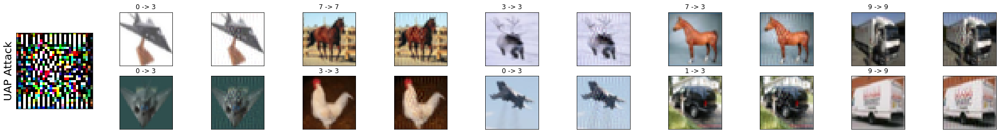

对于FGSM, C&W, UAP等经典对抗攻击方法的学习笔记。

<!--more-->

# adversarial attacks

<!-- vim-markdown-toc GFM -->

* [C&W](#cw)
    * [基本方法](#基本方法)
    * [objective function](#objective-function)
    * [对于常量 $c$](#对于常量-c)
    * [处理盒约束](#处理盒约束)
    * [C&W Attack 中选择不同 objective function 和 box constraint 的结果](#cw-attack-中选择不同-objective-function-和-box-constraint-的结果)
* [FGSM(fast gradient sign method)](#fgsmfast-gradient-sign-method)
    * [对于样本的线性解释](#对于样本的线性解释)
    * [对于非线性模型的线性扰动](#对于非线性模型的线性扰动)
    * [深层神经网络的对抗训练](#深层神经网络的对抗训练)
    * [总结](#总结)
* [UAP Attack](#uap-attack)
    * [算法思想](#算法思想)
    * [算法表述](#算法表述)
    * [攻击结果](#攻击结果)

<!-- vim-markdown-toc -->
## C&W

(参考：《Towards evaluating the robustness of neural networks》（2017.3）)

### 基本方法

寻找对抗样本的过程总归就是一个盒约束的优化问题:

$$ minimize\ D(x,x+\delta) $$

$$ such\ that\ C(x+\delta)=t $$

$$
x+\delta \in[0,1]^n
$$

在这里，D 是距离度量，$C(x+\delta)=t$ 代表网络将对抗样本分类为预设的目标 $t$，我们希望找到一个使得对抗样本与干净样本某种距离度量下具有最小的距离，同时满足，对抗样本的被模型错分为另一类别（可以分为目标攻击和无目标攻击），以及对抗样本要满足自然图片的 RGB 信息约束。

将 $C(x+\delta)=t$ 这样一个约束变为一个等价的 objective function，来和 $D(x,x+\delta)$ 一起来进行优化，使得产生的扰动 $\delta$ 满足 $x+\delta \in[0,1]^n$ 这个约束。

### objective function



对于 objective function $f$ ，使得 $C(x+\delta)=t$ 当且仅当 $f(x+\delta)\leq 0$

其中

-   $x\prime=x+\delta$

-   $Loss_{F,t}(x\prime)$ 代表分类器输出和目标 $t$ 的 cross entropy

-   $soflplus(x)=log(1+e^x)$

-   $Z$ 代表无 softmax 的网络，$F$ 代表有 softmax 的网络

-   $(e)^+$ 代表 $max(0,e)$

原先的式子可以进行替换

$$
minimize\ D(x,x+\delta)+c\cdot f(x+\delta)
$$

$$
such\ that \ x+\delta \in[0,1]^n
$$

再将距离度量 $D$ 定义为 $p$ 范数，就得到：

$$
minimize\ \|\delta\|_p +c\cdot f(x+\delta)
$$

$$
such\ that \ x+\delta \in[0,1]^n
$$

### 对于常量 $c$



当 $c=1$ 时较合适

### 处理盒约束

1. Projected gradient descent

2. Clipped gradient descent

3. Change of variables

### C&W Attack 中选择不同 objective function 和 box constraint 的结果

使用 Best Case, Average Case, Worst Case 进行实验



其中 $f_6$ 表现最好

## FGSM(fast gradient sign method)

(参考：《Explaining And Harnessing Adversarial Examples》（2015.3）)

### 对于样本的线性解释

由于数字图像通常每个像素使用 8 位来表述，导致特征精度是有限的，所以会丢失低于动态范围 1/255 的信息。故对于扰动 $\eta$ 的每个元素都小于特征精度，希望分类器对于输入 $x$ 的相应与对抗输入 $\tilde{x} = x + \eta$ 做出不同相应是不合理的。想要 $x$ 和 $\tilde{x}$ 响应出相同的类别，则需要 $\|\eta\|_\infty <\epsilon$ ，其中 $\epsilon$ 可以忽略

权重向量 $w$ 和对抗样本 $\tilde{x}$ 的乘积可以表述为：
$$w^{T}\tilde{x} = w^{T}x+w^T\eta$$

通过赋予 $\eta=sign(w)$ ，在 $\eta$ 上受大最大范数约束的情况下最大化此激活。对于 $n$ 维平均权重向量为 $m$ 的权重向量$w$ ，这种激活将以 $\epsilon mn$ 的形式增加，随着维度增加，此时对于输入的微小改变则会引起输出较大的改变。

此说明表明，如果简单线性模型的输入具有足够的维度，则可以具有对抗样本。

### 对于非线性模型的线性扰动



设 $\theta$ 为模型参数， $x$ 为模型输入， $y$ 是和 $x$ 相关联的目标，神经网络的损失函数为 $J(\theta,x,y)$ 。可以围绕 $\theta$ 的当前值来线性化损失函数，以获得：
$$\eta=\epsilon sign(\nabla_xJ(\theta,x,y))$$
的最优最大范数约束下的扰动。称之为快速梯度符号方法

### 深层神经网络的对抗训练

通过训练对抗样本和干净样本的混合，可以对神经网络进行一定程度的正则化。关于对抗样本的训练与其他数据增强方案有所不同。通常，人们会使用转换（例如预期在测试集中实际发生的转换）来扩充数据。相反，这种形式的数据增强使用了不太可能自然发生的输入，但暴露了以模型概念化其决策功能的方式的缺陷。当时，从未证明此程序可以改进以达到最新基准水平。但是，这部分是因为很难对基于 L-BFGS 的昂贵的对抗样本进行广泛的实验。

基于快速梯度符号法(FGSM)的对抗目标函数训练是一种有效的正则化器：

$$\tilde{J}(\theta,x,y)=\alpha J(\theta,x,y)+(1-\alpha)J(\theta,x+\epsilon sign(\nabla_x J(\theta,x,y)))$$

### 总结

1. 对抗样本可以解释为高维点积的属性，它们是模型过于线性而不是非线性的结果
2. 跨不同模型的对抗样本的泛化可以解释为对抗性扰动与模型的权重向量高度一致的结果，不同的模型在训练执行相同的任务时学习相似的功能。
3. 最重要的是扰动的方向，而不是空间中的特定点。
4. 易于优化的的模型很容易受到干扰

## UAP Attack



### 算法思想

对于一个数据点集 $x$ ,希望找到一个向量 $v$ 可以迷惑分类器 $\hat{k}$ 使得：
$$ \hat{k}(x+v)\neq \hat{k}(x) \ for \ most \ x\backsim \mu $$

同时对于这样一个扰动 $v$ 存在约束

1. $\|v\| _ p < \xi$
2. $P_{x \backsim \mu}(\hat{k}(x+v) \neq \hat{k}(x))\leq 1-\delta$



如图所示，通过多次迭代，使用每次迭代获得的 $v_i$ 一步步将 $x$ 数据点从原本三个类别重合的区域分类到 $R_3$

### 算法表述



### 攻击结果

图中扰动进行了可视化处理，真实扰动比这要小
    

    

