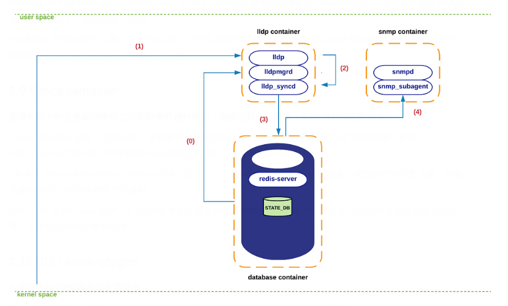

借助 mermaid 在 markdown 中嵌入图表

<!--more-->

# SONiC 系统

## 1.架构总览
SONiC系统的架构依托与**Docker**与**Redis**，由许多模块组成，这些模块通过一个集中的、可扩展的架构相互作用。
这个结构依赖于redis-database引擎的使用：即一个键-值数据库。它提供一个独立于语言的接口，一个用于所有SONiC子系统之间的数据持久性、复制和多进程通信的方法。
具有 `publisher/subscriber` 的消息传递模式，应用程序可以只订阅它们需要的数据，无须知道功能的具体实现细节。
SONiC将每个模块放置在独立的docker容器中，以保持组件之间的高内聚性，同时减少不相连组件之间的耦合。
主要有以下docker容器：

- Teamd：运行并实现链路聚合（LAG）功能。
- Pmon：记录硬件传感器读数并发出警报。
- Snmp：实现SNMP功能。
- Dhcp-relay：将DHCP请求从没有DHCP服务器的子网中连接到其他子网上的一台或多台DHCP服务器。
- Lldp：实现链路层发现协议功能。建立lLLDP连接。
- Bgp：运行支持的路由协议之一，例如ospf，isis，ldp，bgp等。
- Database：redis-engine托管的主要数据库。
- Swss：实现所有SONiC模块之间进行有效通信和与SONiC应用层之间的交互。监听并推送各个组件的状态。
- Syncd：实现交换机网络状态和实际硬件进行同步

下图是这些容器的结构图以及如何容器之间如何进行交互。蓝色箭头来表示与集中式redis引擎的交互，黑色箭头来表示其他的交互（netlink, /sys file-system, etc）。SONiC的配置模块sonic-cfggen和CLI是存在于Linux主机中的模块。


- 数据库驱动：以`RedisDB`为核心
- 高可靠性：所有的用户进程都被封装在容器中
- 硬件通用性：统一的SAI接口，屏蔽了不同厂商的SDK差异
- 特性精简：满足数据中心应用的特性集

## 2.各模块功能
### 2.1 Teamd container
运行并实现**LAG（Link Aggregation functionality）链路聚合**。teamsyncd 模块允许teamed与南向子系统进行交互
另：LAG：链路聚合是在两个设备间使用多个物理链路创建一个逻辑链路的功能，这种方式允许物理链路间共享负载。交换机网络中使用的一种链路聚合的方法是EtherChannel。EtherChannel可以通过协议PAGP（Port Aggregation Protocol）或LACP（Link Aggregation Protocol）来配置。
[链路聚合](https://blog.csdn.net/qq_23930765/article/details/119815287?ops_request_misc=&request_id=&biz_id=102&spm=1018.2226.3001.4187)
### 2.2 Pmon container
“ sensored”的守护程序，记录**硬件传感器**读数并发出警报。托管“ fan-control”进程，收集与风扇相关的状态。
### 2.3 Snmp container

- Snmpd：snmp服务器，负责处理从外部网络元素传入的snmp轮询。
- Snmp-agent(sonic_ax_impl)：snmp子代理的实现，从集中式redis-engine中的SONiC数据库收集信息,提供给主代理(snmpd)。

另：SNMP(Simple Network Management Protocol)：应用层协议，靠UDP进行传输。常用于对路由器交换机等网络设备的管理，管理人员通过它来**收集网络设备运行状况，了解网络性能、发现并解决网络问题。**SNMP分为管理端和代理端(agent)，管理端的默认端口为UDP 162，主要用来接收Agent的消息如TRAP告警消息;Agent端使用UDP 161端口接收管理端下发的消息如SET/GET指令等。
[Snmp](https://blog.csdn.net/bbwangj/article/details/80981098?ops_request_misc=%257B%2522request%255Fid%2522%253A%2522165562805216782390518627%2522%252C%2522scm%2522%253A%252220140713.130102334..%2522%257D&request_id=165562805216782390518627&biz_id=0&spm=1018.2226.3001.4187)
### 2.4 Dhcp-relay container
DHCP中继代理可将DHCP请求从没有DHCP服务器的子网中连接到其他子网上的一台或多台DHCP服务器。
另：DHCP（Dynamic Host Configuration Protocol）：动态主机配置协议，是一个应用层协议。当我们将客户主机ip地址设置为动态获取方式时，**DHCP服务器就会根据DHCP协议给客户端分配IP，使得客户机能够利用这个IP上网。集中的管理、分配IP地址，使网络环境中的主机动态的获得IP地址、Gateway地址、DNS服务器地址等信息。**
[HDCP](https://www.cnblogs.com/ruochenchen/archive/2013/05/18/3085776.html)
### 2.5 Lldp container

- lldp：实现LLDP功能，建立lldp连接以advertise/receive系统功能。
- Lldp_syncd：上传LLDP的发现的状态到redis-engine，这样可以使得需要此状态的应用（如SNMP）从redis处获得此信息。
- Lldpmgr：为lldp进程提供incremental-configuration功能，它通过订阅redis引擎中的STATE_DB来实现。

另：LLDP（Link Layer Discovery Protocol）：链路层发现协议。设备通过在网络中发送LLDPDU（Data Unit）来通告其他设备自身的状态（理地址，设备标识，接口标识等）。可以使不同厂商的设备在网络中相互发现并**交互各自的系统及配置信息**。 当一个设备从网络中接收到其它设备的这些信息时，它就将这些信息以MIB的形式存储起来。**LLDP只传输，不管理**。
[LLDP](https://blog.csdn.net/tushanpeipei/article/details/112481861?ops_request_misc=%257B%2522request%255Fid%2522%253A%2522165562870316782391827960%2522%252C%2522scm%2522%253A%252220140713.130102334..%2522%257D&request_id=165562870316782391827960&biz_id=0&spm=1018.2226.3001.4187)
另：MIB（Management Information Base）：管理信息库。网络管理的标准架构之一，MIB定义了受管设备必须保存的数据项、允许对每个数据项进行的操作及其含义，即管理系统可访问的受管设备的控制和状态信息等数据变量都保存在MIB中。
### 2.6 Bgp container
运行支持的路由协议之一，例如ospf，isis，ldp，bgp等。

- bgpd：路由的实现。外部的路由状态通过常规的tcp/udp sockets 接收，并通过zebra / fpmsyncd接口下推到转发平面。
- zebra：充当传统的IP路由管理。它提供内核路由表的更新，接口的查找和路由的重新分配。将计算出的FIB下推到内核（通过netlink接口）和转发过程中涉及的南向组件（通过Forwarding-Plane-Manager，FPM接口）
- fpmsyncd：收集zebra下发的FIB状态，将内容放入redis-engine托管的APPL-DB中。

另：FIB（Forward Information dataBase）：转发信息库。路由一般手段：先到路由缓存（RouteTable）中查找表项，如果能查找到，就直接将对应的一项作为路由规则；如果查不到，就到FIB中根据规则换算出来，并且增加一项新的，在路由缓存中将项目添加进去。
另：RIB（Route Information dataBase）：FIB强调的是作为转发的路由表，RIB是用来做路由管理的表。RIP、OSPF、BGP、ISIS都是动态路由协议，它们学习到的路由首先要通告给RIB表。RIB表把所有路由协议学习到的路由汇总到一起，把优选结果的路由加入到FIB表，供转发使用。所以FIB是RIB的一个子集。
### 2.7 Database container
redis-engine托管的主要数据库。SONiC应用程序可以通过公开的UNIX socket访问该引擎中保存的数据库。

- **APPL_DB**: 储存所有应用容器生成的状态，如路由、下一跳、邻居节点等。所有应用与SONiC其他子系统交互的南向接入点。
- **CONFIG_DB**: 储存SONiC应用产生的配置状态，如 port configurations, interfaces, vlans, 等。
- **STATE_DB**: 储存实体配置的 “key” 操作状态，以确保SONiC子系统间的依赖性。例如，LAG端口通道可能潜在的指代物理端口、VLAN的定义可以引用系统中不确定的端口的成员。存储所有解决交叉模块依赖性的状态。
- **ASIC_DB**: 存储必要的运行ASIC配置和操作的驱动状态。存储格式易于syncd与asic SDK的交互。
- **FLEX_COUNTER_DB**: 存放灵活计数器配置。
- **COUNTERS_DB**: 存储每个端口的 counters/statistics。能够满足CLI本地需求或用于遥测通道。

### 2.8 Swss container

Switch State Service，包含一组工具，以**允许所有SONiC模块之间进行有效通信**。**database container主要提供存储能力，Swss主要侧重于提供促进所有不同方之间的通信和仲裁的机制。**
Swss也负责与北向的应用层进行交互。fpmsyncd, teamsyncd and lldp_syncd是例外。这种提供SONiC应用与SONiC中心架构(redis-engine)的连接的进程都被命名为*syncd。

- Portsyncd: 监听端口相关的连接事件。portsyncd在启动阶段获得物理端口信息，全部发送给APPL_DB，端口速度，链路和mtu都通过这个通道传输。Portsyncd还将状态发送到STATE_DB。
- Intfsyncd: 侦听与接口相关的netlink事件，发送给APPL_DB。例如新的和更改的接口的IP地址在这个进程中处理。
- Neighsyncd:监听邻居事件相关的netlink事件，例如mac地址与邻居的address-family。 这些状态会构建数据平面中以L2-rewrite为目的所需的adjacency-table。所有的状态也都会传输给APPL_DB。
- Teamsyncd: 和Teamd container共同运行，获得的状态发送给APPL_DB。
- Fpmsyncd: 和bgp container共同运行，获得的状态发送给APPL_DB。Previously discussed – running within bgp docker container. Again, collected state is injected into APPL_DB.
- Lldp_syncd: 和lldp container共同运行。

当将信息注入redis-engine所代表的publisher-subscriber流水线时，上述过程显然充当了状态产生者的角色。但是，必须有一个进程集合来订阅和重新分配所有到来的状态，这就是以下进程：

- Orchagent: Swss里最关键的部分。包含如何从*synd中提状态的逻辑，相应地处理和发送信息，最终发送到南向接口。Orchagent既获取来自APPL_DB的状态，又将状态推送到ASIC_DB中。
- IntfMgrd: 对到达APPL_DB、CONFIG_DB、STATE_DB的状态做出反应来配置Linux内核接口。这一步只在没有状态冲突或者状态不一致的情况下完成。
- VlanMgrd: 对到达APPL_DB、CONFIG_DB、STATE_DB的状态做出反应来配置Linux内核vlan接口。只有在没有任何依赖状态/条件被满足时，才会执行此步骤。
### 2.9 Syncd container
**提供机制允许交换机网络状态和实际硬件进行同步，包括初始化、配置、ASIC当前状态的收集。**

- Syncd: 执行同步逻辑，在编译时，连接硬件厂商提供的ASIC SDK库，并通过调用为此提供的接口将状态注入ASIC。Syncd订阅ASIC_DB来获取Swss的状态，同时，推送来自硬件的状态。
- SAI API: Switch Abstraction Interface (SAI) 定义了一个API来提供一个厂商独立的统一规范的控制转发元素，例如交换机ASIC，NPU或者软件交换机。
- ASIC SDK: 硬件厂商应提供一个与SAI能够友好交互的SDK来驱动他们的芯片。通常以动态链接库的形式提供此实现，该库链接到对应驱动程序。
### 2.10 CLI / sonic-cfggen
负责提供**CLI功能和系统配置能力**。

- CLI ：依赖于Python的Click库来提供使用者灵活性和自定义的方法来构建命令行工具。
- Sonic-cfggen：被CLI调用来实现配置的改变或者任何与SONiC模块交互的配置动作。
## 3.子系统交互
### **LLDP 状态交互**
下图描述了在 lldp 状态转移期间观察到的一组相互作用。在这个特定的示例中，我们迭代了在携带状态变化的 LLDP 消息到达时发生的一系列步骤。

- (1) 在 LLDP 容器初始化期间， lldpmgrd 订阅 STATE_DB 以实时获取系统中物理端口的状态 —— lldpmgrd 的轮询周期每 5 秒运行一次。基于这些信息， Lldpd (及其网络对等体) 将了解系统端口状态的变化以及影响其运行的任何配置变化。
- (2) 一个新的 LLDP 报文到达内核空间的 LLDP socket 。内核的网络栈最终将相关的有效负载交付给 lldp 进程。
- (3) Lldp 解析并消化这个新状态， lldp_syncd 在执行 lldpctl cli 命令 (通常每 10 秒运行一次) 的过程中最终获取这个新状态。
- Lldp_syncd 将这个新状态推到 APPL_DB 中，具体地说，推到 LLDP_ENTRY_TABLE 表中。
- (5) 从现在开始，所有订阅这个表的实体都应该收到一个新状态的副本 (目前， snmp 是唯一感兴趣的侦听器)。



### **SNMP 状态交互**
如前所述， snmp 容器同时承载一个 snmp 主代理 (snmpd) 和一个特定于 sonic 的 agentX 进程 ( snmp_subagent )。该子代理与所有 redis 数据库 / 表进行交互，这些 redis 数据库 / 表提供了可以派生 MIB 状态的信息。具体来说， snmp-agent 订阅了以下数据库 / 表:

- **APPL_DB**: PORT_TABLE, LAG_TABLE, LAG_MEMBER_TABLE, LLDP_ENTRY_TABLE
- **STATE_DB**: *
- **COUNTERS_DB**: *
- **ASIC_DB: ASIC_STATE**:SAI_OBJECT_TYPE_FDB*

下图描述了系统处理传入 snmp 查询期间各种 SONiC 组件之间的典型交互。

- (0) 在初始化 snmp-subagent 进程中支持的不同 MIB 子组件时，该 MIB 子组件与上述各个 db 建立连接。从这一刻起，从所有这些 db 获得的状态被本地缓存到 snmp-subagent 中。该信息每隔几秒 (< 60) 刷新一次，以确保 db 和 snmp-subagent 完全同步。
- (1) 一个 snmp 查询到达内核空间的 snmp 的套接字。内核的网络栈将数据包发送给 snmpd 进程。
- (2) snmp 消息被解析，一个相关的请求被发送到 SONiC 的 agentX 子代理 (即 sonic_ax_impl)。
- (3) Snmp-subagent 服务于其本地数据结构中缓存的状态之外的查询，并将信息发送回 snmpd 进程。
- (4) Snmpd 最终通过常用的 socket 接口向发起者发送一个应答。


### **路由状态交互**
在本节中，我们将遍历发生在 SONiC 中的一系列步骤，以处理从 eBGP 对等体接收到的新路由。我们假设这个会话已经建立，并且我们正在学习一条新的路由，它使用一个直接连接的对等体作为它的下一跳。

- (0) 在 BGP 容器初始化过程中， zebra 通过常规 TCP 套接字连接到 fpmsyncd 。在稳定 / 非瞬态条件下，存放在 zebra 、 linux 内核、**APPL_DB** 和 **ASIC_DB** 中的路由表应该是完全一致 / 等效的。
- (1) 一个新的 TCP 报文到达内核空间的 bgp socket。内核的网络栈最终将相关的有效载荷传递给 bgpd 进程。
- (2) Bgpd 解析新报文，处理 bgp-update，并通知 zebra 这个新前缀的存在及其相关的下一跳协议。
- (3) zebra 通过判断该前缀的可行性 / 可达性 (例如现有的转发 nh)，生成一个 route-netlink 消息将这个新的状态注入到 kernel 中。 Zebra 利用 FPM 接口将这个网络链路路由消息传递给 fpmsyncd。
- (5) Fpmsyncd 处理 netlink 消息，并将此状态推入 **APPL_DB**。
- 作为一个 APPL_DB 订阅者，它将接收先前推送到 **APPL_DB** 的信息的内容。
- (7) 处理完接收到的信息后，orchagentd 会调用 sairedis api 将路由信息注入到 **ASIC_DB** 中。同步一个 ASIC_DB 订阅者时，它将接收由 orchagentd 生成的新状态。
- (9) Syncd 将处理该信息，并调用 SAI api 将该状态注入到相应的 asic 驱动程序中。
- (10) 新路由最终推送到硬件。


### **端口状态交互**
本节描述在端口相关信息传输过程中发生的系统交互。考虑到 portsyncd 扮演的关键角色，以及它在其他 SONiC 子系统中施加的依赖关系，我们将从介绍它的初始化过程开始本节。
这个练习有两个目的。首先，我们公开了系统中对生成或使用端口相关信息感兴趣的多个组件。其次，我们将通过一个图形示例向读者介绍 **STATE_DB** 在系统中是如何使用的，以及不同的应用程序如何依赖它的信息进行内部操作。

- (0) 在初始化过程中，portsyncd 与 redis-engine 中的主要数据库建立通信通道。Portsyncd 声明其意图充当 **APPL_DB** 和 **STATE_DB** 的发布者，以及 **CONFIG_DB** 的订阅者。同样，portsyncd 也订阅系统的 netlink 通道，负责携带端口 / 链路状态信息。
- (1) Portsyncd 通过解析与系统中使用的硬件配置文件 /sku 相关联的端口配置文件 (port_config.ini) 开始（有关更多详细信息，请参阅配置部分）。通道、接口名称、接口别名、速度等与端口相关的信息通过该通道传输到 **APPL_DB**。
- (2) Orchagent 会听到所有这些新状态，但会推迟对其采取行动，直到 portsyncd 通知它已完全解析 port_config.ini 信息。一旦发生这种情况，orchagent 将继续在硬件 / 内核中初始化相应的端口接口。Orchagent 调用 sairedis API 以通过通常的 **ASIC_DB** 接口将此请求传送到同步。
- (3) Syncd 通过 **ASIC_DB** 接收到这个新请求，并准备调用满足 Orchagent 请求所需的 SAI API。
- (4) Syncd 利用 SAI APIs + ASIC SDK 创建与正在初始化的物理端口相关联的内核主机接口。
- (5) 上一步将生成一个 netlink 消息，该消息将被 portsyncd 接收。当与先前从 port_config.ini 解析的所有端口相关联的消息到达 portsyncd 时（在步骤 1 中），portsyncd 将继续声明 “初始化” 过程已完成。
- (6) 作为上一步的一部分，portsyncd 将记录条目写入与成功初始化的每个端口对应的 STATE_DB。
- (7) 从这一刻起，之前订阅了 **STATE_DB** 内容的应用程序将收到通知，允许这些应用程序开始使用它们所依赖的端口。换句话说，如果在 **STATE_DB** 中找不到特定端口的有效条目，则任何应用程序都无法使用它。


```
NOTE : As of today, these are the applications actively
listening to the changes in STATE_DB: teamsyncd, intfmgrd, vlanmgrd
and lldpmgr. We will cover all these components in subsequent
sections -- lldpmgr has been already tackled abov
```
现在，让我们遍历物理端口关闭时发生的一系列步骤：

- (0) 正如前面概述部分中提到的，syncd 在 **ASIC_DB** 的上下文中既作为发布者又作为订阅者执行。“订阅者” 模式显然是因为需要 syncd 从北向应用程序接收状态，就像迄今为止看到的所有模块交互的情况一样。需要 “发布者” 模式以允许 syncd 将硬件产生的事件到达通知更高级别的组件。
- (1) 在相应 ASIC 的光模块检测到载波丢失后，将向相关驱动程序发送通知，后者又将此信息传递给 syncd。
- (2) Syncd 调用适当的通知处理程序并将端口关闭事件发送到 **ASIC_DB**。
- (3) Orchagent 利用其通知线程（专用于此任务）从 **ASIC_DB** 收集新状态，并执行 “port-state-change” 处理程序以：
```
a.  Generate an update to APPL\_DB to alert applications relying on
    this state for their operation (e.g. CLI -- "show interface
    status").

b.  Invoke sairedis APIs to alert syncd of the need to update the
    kernel state associated to the host-interface of the port being
    brought down. Again, orchagent delivers this request to syncd
    through the usual ASIC\_DB interface.
```

- (4) Syncd 通过 **ASIC_DB** 接收到这个新请求，并准备调用满足 orchagent 请求所需的 SAI API。
- (5) Syncd 使用 SAI APIs + ASIC SDK 来更新内核与受影响主机接口的最新操作状态 (DOWN)。
- (6) 在 portsyncd 处接收到与上一步相关联的 netlink 消息，由于所有 SONiC 组件现在完全知道端口关闭事件，因此该消息被静默丢弃。


## 参考文献

- SONiC official wiki: [https://github.com/Azure/SONiC/wiki](https://github.com/Azure/SONiC/wiki) （SONiC 官方维基）
- SONiC architecture: [https://github.com/Azure/SONiC/wiki/Architecture](https://github.com/Azure/SONiC/wiki/Architecture) （SONiC 架构）
- Frytea blog:[https://blog.frytea.com/archives/533/](https://blog.frytea.com/archives/533/) (Frytea个人博客)
- 知乎：[https://www.zhihu.com/search?type=content&q=sonic%20%E7%B3%BB%E7%BB%9F%E6%9E%B6%E6%9E%84](https://www.zhihu.com/search?type=content&q=sonic%20%E7%B3%BB%E7%BB%9F%E6%9E%B6%E6%9E%84) （SONiC架构分析）
