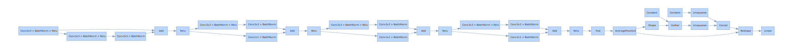
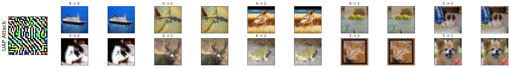
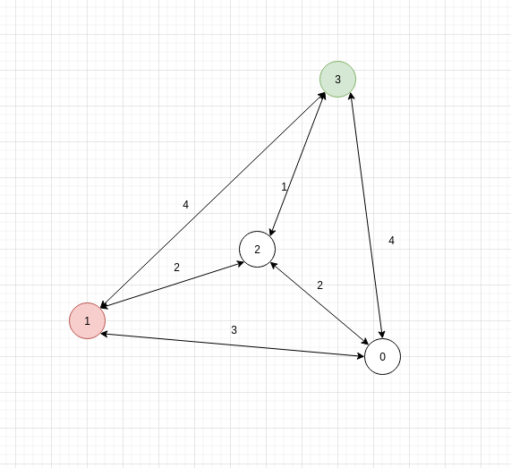
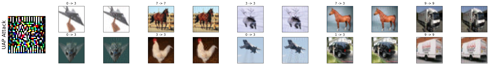

UAP 生成对抗样本实践(pytorch)

<!--more-->

# UAP 原理与实现


<!-- vim-markdown-toc GFM -->

* [算法思想](#算法思想)
* [算法表述](#算法表述)
    * [无目标攻击](#无目标攻击)
    * [有目标攻击](#有目标攻击)
    * [范数约束](#范数约束)
* [UAP 实现](#uap-实现)
    * [导入模块](#导入模块)
    * [超参数](#超参数)
    * [获取 cifar10 数据集](#获取-cifar10-数据集)
    * [定义网络](#定义网络)
    * [创建 simple_model 对象，并可视化网络](#创建-simple_model-对象并可视化网络)
    * [训练模型](#训练模型)
    * [模型测试](#模型测试)
    * [UAP 算法](#uap-算法)
* [Attack test](#attack-test)
* [Target attack](#target-attack)

<!-- vim-markdown-toc -->




## 算法思想

对于一个数据点集 $x$ ,希望找到一个向量 $v$ 可以迷惑分类器 $\hat{k}$ 使得：
$$ \hat{k}(x+v)\neq \hat{k}(x) \ for \ most \ x\backsim \mu $$

同时对于这样一个扰动 $v$ 存在约束

1. $\|v\| _ p < \xi$
2. $P_{x \backsim \mu}(\hat{k}(x+v) \neq \hat{k}(x))\leq 1-\delta$




如图所示，通过多次迭代，使用每次迭代获得的 $v_i$ 一步步将 $x$ 数据点从原本三个类别重合的区域分类到 $R_3$

## 算法表述



### 无目标攻击



### 有目标攻击



### 范数约束

$$limtfunc(dist, epsilon) = dist * min ( 1, \frac{\epsilon}{\|\|dist\|\|} )$$

## UAP 实现

### 导入模块

```python
from **future** import print_function
import torch
import numpy as np
import torch.nn as nn
from torchvision import datasets, transforms
from tqdm import tqdm
from absl import app, flags
import torchvision
import math
import matplotlib.pyplot as plt
```

### 超参数

```python
BATCH_SIZE = 10
EPOCH = 5
LEARNING_RATE = 0.001
device = torch.device("cuda" if (torch.cuda.is_available()) else "cpu")
device(type='cuda')
```

### 获取 cifar10 数据集

```python
transform = transforms.Compose([transforms.ToTensor()])
train_dataset = datasets.CIFAR10(root='../data/Cifar10',
train=True,
transform=transform,
download=True)
train_loader = torch.utils.data.DataLoader(dataset=train_dataset,
batch_size=BATCH_SIZE,
shuffle=True)
test_dataset = datasets.CIFAR10(root='../data/Cifar10',
train=False,
transform=transform,
download=True)
test_loader = torch.utils.data.DataLoader(dataset=test_dataset,
batch_size=BATCH_SIZE,
shuffle=True)
```

    Files already downloaded and verified
    Files already downloaded and verified

### 定义网络
```python
 class ResidualBlock(nn.Module):
    def __init__(self, inchannel, outchannel, stride=1):
        super(ResidualBlock, self).__init__()
        # 这里的即为两个3*3 conv
        self.left = nn.Sequential(
            nn.Conv2d(inchannel,
                      outchannel,
                      kernel_size=3,
                      stride=stride,
                      padding=1,
                      bias=False),  # bias为偏置，False表示不添加偏置
            nn.BatchNorm2d(outchannel),
            nn.ReLU(),
            nn.Conv2d(outchannel,
                      outchannel,
                      kernel_size=3,
                      stride=1,
                      padding=1,
                      bias=False),
            nn.BatchNorm2d(outchannel))
        self.shortcut = nn.Sequential()  # shortcut connections
        if stride != 1 or inchannel != outchannel:  # 判断入通道和出通道是否一样，不一样的话进行卷积操作
            self.shortcut = nn.Sequential(
                nn.Conv2d(inchannel,
                          outchannel,
                          kernel_size=1,
                          stride=stride,
                          bias=False), nn.BatchNorm2d(outchannel))
        self.relu = nn.ReLU()

    def forward(self, x):
        out = self.left(x)
        out += self.shortcut(x)
        out = self.relu(out)
        return out


class Net(nn.Module):
    def __init__(self, ResidualBlock):
        super(Net, self).__init__()

        # 图片处理，也就是白色方框内的3*3 conv
        self.conv1 = nn.Sequential(
            nn.Conv2d(3, 64, kernel_size=3, stride=1, padding=1, bias=False),
            nn.BatchNorm2d(64),
            nn.ReLU(),
        )

        # 中间的残差网络部分，与图上的结构一一对应
        self.layer1 = self.make_layer(ResidualBlock, 64, 64, 2, stride=1)
        self.layer2 = self.make_layer(ResidualBlock, 64, 128, 2, stride=2)
        self.layer3 = self.make_layer(ResidualBlock, 128, 256, 2, stride=2)
        self.layer4 = self.make_layer(ResidualBlock, 256, 512, 2, stride=2)
        self.avg_pool2d = nn.AvgPool2d(4)
        self.fc = nn.Linear(512, 10)

    # 相当于看处理几次，18的是每个处理两次
    def make_layer(self, block, inchannel, outchannel, num_blocks, stride):
        layers = []
        for i in range(1, num_blocks):
            layers.append(block(inchannel, outchannel, stride))
        return nn.Sequential(*layers)

    def forward(self, x):
        out = self.conv1(x)
        out = self.layer1(out)
        out = self.layer2(out)
        out = self.layer3(out)
        out = self.layer4(out)
        out = self.avg_pool2d(out)
        out = out.view(out.size(0), -1)
        out = self.fc(out)
        return out
```


### 创建 simple_model 对象，并可视化网络
```python
simple_model = torch.load("/home/allen/Workplace/Advesarial-Attack-toturial/UAP/model/simple_model.pkl")
optimizer = torch.optim.Adam(simple_model.parameters(),
                             lr=0.001,
                             betas=(0.9, 0.99))
loss_function = nn.CrossEntropyLoss()
print(simple_model)
import hiddenlayer as hl
hl_graph = hl.build_graph(simple_model, torch.zeros([1,3,32,32]).to(device))
hl_graph.theme = hl.graph.THEMES["blue"].copy()
hl_graph
```


    Net(
      (conv1): Sequential(
        (0): Conv2d(3, 64, kernel_size=(3, 3), stride=(1, 1), padding=(1, 1), bias=False)
        (1): BatchNorm2d(64, eps=1e-05, momentum=0.1, affine=True, track_running_stats=True)
        (2): ReLU()
      )
      (layer1): Sequential(
        (0): ResidualBlock(
          (left): Sequential(
            (0): Conv2d(64, 64, kernel_size=(3, 3), stride=(1, 1), padding=(1, 1), bias=False)
            (1): BatchNorm2d(64, eps=1e-05, momentum=0.1, affine=True, track_running_stats=True)
            (2): ReLU()
            (3): Conv2d(64, 64, kernel_size=(3, 3), stride=(1, 1), padding=(1, 1), bias=False)
            (4): BatchNorm2d(64, eps=1e-05, momentum=0.1, affine=True, track_running_stats=True)
          )
          (shortcut): Sequential()
          (relu): ReLU()
        )
      )
      (layer2): Sequential(
        (0): ResidualBlock(
          (left): Sequential(
            (0): Conv2d(64, 128, kernel_size=(3, 3), stride=(2, 2), padding=(1, 1), bias=False)
            (1): BatchNorm2d(128, eps=1e-05, momentum=0.1, affine=True, track_running_stats=True)
            (2): ReLU()
            (3): Conv2d(128, 128, kernel_size=(3, 3), stride=(1, 1), padding=(1, 1), bias=False)
            (4): BatchNorm2d(128, eps=1e-05, momentum=0.1, affine=True, track_running_stats=True)
          )
          (shortcut): Sequential(
            (0): Conv2d(64, 128, kernel_size=(1, 1), stride=(2, 2), bias=False)
            (1): BatchNorm2d(128, eps=1e-05, momentum=0.1, affine=True, track_running_stats=True)
          )
          (relu): ReLU()
        )
      )
      (layer3): Sequential(
        (0): ResidualBlock(
          (left): Sequential(
            (0): Conv2d(128, 256, kernel_size=(3, 3), stride=(2, 2), padding=(1, 1), bias=False)
            (1): BatchNorm2d(256, eps=1e-05, momentum=0.1, affine=True, track_running_stats=True)
            (2): ReLU()
            (3): Conv2d(256, 256, kernel_size=(3, 3), stride=(1, 1), padding=(1, 1), bias=False)
            (4): BatchNorm2d(256, eps=1e-05, momentum=0.1, affine=True, track_running_stats=True)
          )
          (shortcut): Sequential(
            (0): Conv2d(128, 256, kernel_size=(1, 1), stride=(2, 2), bias=False)
            (1): BatchNorm2d(256, eps=1e-05, momentum=0.1, affine=True, track_running_stats=True)
          )
          (relu): ReLU()
        )
      )
      (layer4): Sequential(
        (0): ResidualBlock(
          (left): Sequential(
            (0): Conv2d(256, 512, kernel_size=(3, 3), stride=(2, 2), padding=(1, 1), bias=False)
            (1): BatchNorm2d(512, eps=1e-05, momentum=0.1, affine=True, track_running_stats=True)
            (2): ReLU()
            (3): Conv2d(512, 512, kernel_size=(3, 3), stride=(1, 1), padding=(1, 1), bias=False)
            (4): BatchNorm2d(512, eps=1e-05, momentum=0.1, affine=True, track_running_stats=True)
          )
          (shortcut): Sequential(
            (0): Conv2d(256, 512, kernel_size=(1, 1), stride=(2, 2), bias=False)
            (1): BatchNorm2d(512, eps=1e-05, momentum=0.1, affine=True, track_running_stats=True)
          )
          (relu): ReLU()
        )
      )
      (avg_pool2d): AvgPool2d(kernel_size=4, stride=4, padding=0)
      (fc): Linear(in_features=512, out_features=10, bias=True)
    )


    /home/allen/.miniconda/envs/pytorch/lib/python3.7/site-packages/torch/onnx/symbolic_helper.py:446: UserWarning: ONNX export mode is set to inference mode, but operator batch_norm is set to inference mode. The model will be exported in inference, as specified by the export mode.
      training_mode + ", as specified by the export mode.")




### 训练模型
```python
def train(model, optimizer):
    for i in range(EPOCH):
        print(f"第{i+1}次训练....")
        for j, (image, label) in tqdm(enumerate(train_loader)):
            image = image.to(device)
            label = label.to(device)
            x = model(image)
            loss = loss_function(x, label)
            optimizer.zero_grad()
            loss.backward()
            optimizer.step()
            if j * BATCH_SIZE % 2000 == 0 and j != 0:
                print('第{}个数据，loss值等于{}'.format(j * BATCH_SIZE, loss))


train(simple_model, optimizer)

simple_model.eval()
```

### 模型测试

```python
def test(model, name):
    correct_num = torch.tensor(0).to(device)
    total = torch.tensor(0).to(device)
    for j, (data, target) in tqdm(enumerate(test_loader)):
        data = data.to(device)
        target = target.to(device)
        logit = model(data)
        pred = logit.max(1)[1]
        total += target.size(0)
        num = torch.sum(pred == target)
        correct_num = correct_num + num
    print(correct_num)
    print('\n{} correct rate is {}'.format(name, correct_num / total))


test(simple_model, 'simple model')
```


    1000it [00:10, 93.09it/s]

    tensor(8207, device='cuda:0')

    simple model correct rate is 0.8206999897956848

### UAP 算法

```python
from torch.autograd import Variable
import copy
from torch.autograd.gradcheck import zero_gradients
```

- 无目标 Deepfool attack 算法

```python
def Attack(image, net, max_iter=50, overshoot=0.02, num_classes=10):
    output = net(Variable(image.to(device), requires_grad=True))
    pred = torch.argmax(output)
    #    if pred != label.item():
    #        return False, pred, image, torch.zeros_like(image)
    adv_pred = pred
    # print(output)
    # print(pred)

    dist = torch.zeros_like(image)
    delta_Grad = torch.zeros_like(image)
    adv_image = copy.deepcopy(image)

    loop_cnt = 0

    x = Variable(adv_image, requires_grad=True)
    adv_output = net(x)

    while adv_pred == pred and loop_cnt < max_iter:
        pert = np.inf
        adv_output[0, pred].backward(retain_graph=True)
        orig_grad = x.grad.data.cpu().numpy().copy()

        for i in range(0, num_classes):
            if i == pred:
                continue
            zero_gradients(x)
            adv_output[0, i].backward(retain_graph=True)
            cur_grad = x.grad.data.cpu().numpy().copy()
            delta_grad = cur_grad - orig_grad
            delta_val = (adv_output[0, i] -
                         adv_output[0, pred]).data.cpu().numpy().copy()
            pert_i = abs(delta_val) / np.linalg.norm(delta_grad.flatten())
            if pert_i < pert:
                pert = pert_i
                delta_Grad = delta_grad

        delta_dist = torch.from_numpy((pert + 0.0001) * delta_Grad /
                                      np.linalg.norm(delta_Grad)).to(device)
        dist = dist + delta_dist
        adv_image = image + (1 + overshoot) * dist

        x = Variable(adv_image, requires_grad=True)
        adv_output = net(x)
        adv_pred = torch.argmax(adv_output)
        loop_cnt += 1

    return loop_cnt, dist
```


- 约束函数(uap 扰动较大，无穷范数约束效果不佳，所以以下实验均采用 2 范数约束)

```python
def project_perturbation(epsilon, p, perturbation, imagesize):
    perturbation = perturbation.cpu().numpy()
    # print("orgi", perturbation)
    if p == 2:
        epsilon = epsilon * math.sqrt(imagesize[0] * imagesize[1] * imagesize[2])
        perturbation = perturbation * min(
            1, epsilon / np.linalg.norm(perturbation.flatten()))
    elif p == np.inf:
        perturbation = np.sign(perturbation) * np.minimum(
            abs(perturbation), epsilon)
    # exit()
    return torch.from_numpy(perturbation).cuda()
```

```
def UAP(dataset,
        testset,
        imagesize,
        net,
        delta=0.2,
        p=2,
        epsilons=0.05,
        num_classes=10,
        overshoot=0.02,
        max_iter_uni=np.inf,
        max_iter_df=50):
    net.eval()
    v = torch.zeros([1, 3, 32, 32])
    fool_rate = 0.0
    best_rate = 0.0
    iter_uni = 0

    while fool_rate < 1 - delta and max_iter_uni > iter_uni:
        iter_uni += 1
        data_loader = torch.utils.data.DataLoader(dataset,
                                                  batch_size=1,
                                                  shuffle=True,
                                                  pin_memory=True)
        net.cuda()
        for j, (cur_images, cur_label) in tqdm(enumerate(data_loader)):
            cur_image = cur_images[0].unsqueeze(0).cuda()
            per = Variable(cur_image + v.cuda(), requires_grad=True)
            if int(net(cur_image).argmax()) == int(net(per).argmax()):
                net.zero_grad()
                iter, dr = Attack(per,
                                  net,
                                  num_classes=num_classes,
                                  overshoot=overshoot,
                                  max_iter=max_iter_df)
                v = v.cuda() + dr.cuda()
                v = project_perturbation(epsilons, p, v, imagesize)
            if j > 999:
                break

        batch_size = 10
        val_loader = torch.utils.data.DataLoader(dataset=testset,
                                                 batch_size=batch_size,
                                                 shuffle=False)
        # Compute the estimated labels in batches
        ii = 0
        adv_count = 0
        with torch.no_grad():
            for _, (images, labels) in tqdm(enumerate(val_loader)):
                for i in range(torch.numel(labels)):
                    image = images[i].unsqueeze(0).cuda()
                    per_image = (image + v.cuda()).cuda()
                    ii += 1
                    adv_pred = net(per_image).argmax()
                    pred = net(image).argmax()
                    if adv_pred != pred:
                        adv_count += 1

            fool_rate = adv_count / ii
            if fool_rate > best_rate:
                best_rate = fool_rate
            print("ii", ii)
            print("adv", adv_count)
            print(f"Fool rate: {fool_rate}")
            print(f"Best fool rate: {best_rate}")

    return v
```

## Attack test

```python
dist = UAP(test_dataset, test_dataset, (3, 32, 32), simple_model)

plt.figure(figsize=(33, 4))
cnt = 2
for step, (x, y) in enumerate(test_loader):
    plt.subplot(1, 11, 1)
    plt.yticks([])
    plt.xticks([])
    plt.ylabel("UAP Attack", size=20)
    plt.imshow((dist[0] * 80).cpu().numpy().transpose((1, 2, 0)))
    for i in range(BATCH_SIZE):
        if cnt == 12:
            cnt = 13
        image = x[i].unsqueeze(0).cuda()
        # print(torch.argmax(simple_model(adv_image)))
        # print(torch.argmax(simple_model(image)))
        image = x[i].unsqueeze(0).cuda()
        per_image = (image + dist.cuda()).cuda()
        adv_pred = simple_model(per_image).argmax()
        pred = simple_model(image).argmax()
        plt.subplot(2, 11, cnt)
        plt.yticks([])
        plt.xticks([])
        plt.title("{} -> {}".format(pred, adv_pred))
        plt.imshow(image[0].cpu().numpy().transpose((1, 2, 0)))
        plt.subplot(2, 11, cnt + 1)
        plt.yticks([])
        plt.xticks([])
        plt.imshow(per_image[0].cpu().numpy().transpose((1, 2, 0)))
        cnt += 2
    plt.show()
    break
```


    1000it [00:56, 17.81it/s]
    1000it [02:10,  7.66it/s]


    ii 10000
    adv 7588
    Fool rate: 0.7588
    Best fool rate: 0.7588


    1000it [00:45, 21.95it/s]
    1000it [02:10,  7.64it/s]


    ii 10000
    adv 7654
    Fool rate: 0.7654
    Best fool rate: 0.7654


    1000it [00:40, 24.41it/s]
    1000it [02:10,  7.67it/s]


    ii 10000
    adv 7730
    Fool rate: 0.773
    Best fool rate: 0.773


    1000it [00:32, 30.36it/s]
    1000it [01:59,  8.39it/s]


    ii 10000
    adv 7884
    Fool rate: 0.7884
    Best fool rate: 0.7884


    1000it [00:32, 30.53it/s]
    1000it [01:59,  8.38it/s]


    ii 10000
    adv 7839
    Fool rate: 0.7839
    Best fool rate: 0.7884


    1000it [00:30, 32.43it/s]
    1000it [01:59,  8.39it/s]


    ii 10000
    adv 7971
    Fool rate: 0.7971
    Best fool rate: 0.7971


    1000it [00:31, 31.49it/s]
    1000it [01:59,  8.37it/s]
    Clipping input data to the valid range for imshow with RGB data ([0..1] for floats or [0..255] for integers).
    Clipping input data to the valid range for imshow with RGB data ([0..1] for floats or [0..255] for integers).
    Clipping input data to the valid range for imshow with RGB data ([0..1] for floats or [0..255] for integers).
    Clipping input data to the valid range for imshow with RGB data ([0..1] for floats or [0..255] for integers).
    Clipping input data to the valid range for imshow with RGB data ([0..1] for floats or [0..255] for integers).
    Clipping input data to the valid range for imshow with RGB data ([0..1] for floats or [0..255] for integers).


    ii 10000
    adv 8140
    Fool rate: 0.814
    Best fool rate: 0.814


    Clipping input data to the valid range for imshow with RGB data ([0..1] for floats or [0..255] for integers).
    Clipping input data to the valid range for imshow with RGB data ([0..1] for floats or [0..255] for integers).
    Clipping input data to the valid range for imshow with RGB data ([0..1] for floats or [0..255] for integers).
    Clipping input data to the valid range for imshow with RGB data ([0..1] for floats or [0..255] for integers).
    Clipping input data to the valid range for imshow with RGB data ([0..1] for floats or [0..255] for integers).

图中扰动进行了可视化处理，真实扰动比这要小



## Target attack

- 有目标的 Deepfool attack

```python
def TargetAttack(image,
                 net,
                 target,
                 max_iter=50,
                 overshoot=0.02,
                 num_classes=10):
    output = net(Variable(image.to(device), requires_grad=True))
    pred = torch.argmax(output)  # 正常预测结果
    # if pred != label.item():
    #    return False, pred, image, torch.zeros_like(image)
    adv_pred = pred  # 初始化对抗样本的识别结果
    # print(output)
    # print(pred)

    dist = torch.zeros_like(image)  # 初始化扰动
    delta_Grad = torch.zeros_like(image)  # 初始化迭代梯度
    adv_image = copy.deepcopy(image)  # 初始化对抗样本

    loop_cnt = 0

    x = Variable(adv_image, requires_grad=True)
    adv_output = net(x)

    while adv_pred != target and loop_cnt < max_iter:
        pert = np.inf
        adv_output[0, pred].backward(retain_graph=True)
        orig_grad = x.grad.data.cpu().numpy().copy()  # 获取初始梯度
        zero_gradients(x)
        adv_output[0, target].backward(retain_graph=True)
        cur_grad = x.grad.data.cpu().numpy().copy()  # 获取其他output结果的梯度
        delta_Grad = cur_grad - orig_grad  # 获取梯度差
        delta_val = (
            adv_output[0, target] -  # 获取output差
            adv_output[0, pred]).data.cpu().numpy().copy()
        pert = abs(delta_val) / np.linalg.norm(delta_Grad.flatten())
        delta_dist = torch.from_numpy((pert + 0.0001) * delta_Grad /
                                      np.linalg.norm(delta_Grad)).to(device)
        # 获取每次迭代的扰动
        dist = dist + delta_dist
        adv_image = image + (1 + overshoot) * dist  # 生成对抗样本

        x = Variable(adv_image, requires_grad=True)
        adv_output = net(x)
        adv_pred = torch.argmax(adv_output)  # 获得新的预测结果
        # print(adv_pred)
        loop_cnt += 1

    return loop_cnt, dist
```


主要通过抽象距离构建完全图，再利用最短路径算法提高有目标攻击的效率



```python
def GraphBulid(image, net, num_classes=10):
    x = Variable(image.to(device), requires_grad=True)
    output = net(x)
    label = torch.argmax(output)
    grad_list = []
    for i in range(num_classes):
        zero_gradients(x)
        output[0, i].backward(retain_graph=True)
        i_gard = x.grad.data.cpu().numpy().copy()
        grad_list.append(i_gard)
    line = [0 for i in range(num_classes)]
    graph = [line.copy() for i in range(num_classes)]
    # print(grad_list)
    for i in range(num_classes):
        for j in range(i + 1, num_classes):
            delta_val = (output[0, j] - output[0, i]).data.cpu().numpy().copy()
            delta_grad = grad_list[j] - grad_list[i]
            pert_ij = abs(delta_val) / np.linalg.norm(delta_grad.flatten())
            graph[i][j] = pert_ij
            graph[j][i] = pert_ij

    # for i in range(num_classes):
    # print(graph[i])
    return graph, label

def FindShortPath(graph, start, end, num_classes=10):
    flag = [False] * num_classes
    distance = [graph[start][i] for i in range(num_classes)]
    prevetrix = [start] * num_classes
    prevetrix[start] = -1
    count = 1
    flag[start] = True

    while count < num_classes:
        mindist = np.inf
        for i in range(num_classes):
            if (not flag[i] and mindist > distance[i]):
                mindist = distance[i]
                min_index = i
        flag[min_index] = True
        count += 1
        for i in range(num_classes):
            if (not flag[i] and
                    distance[min_index] + graph[min_index][i] < distance[i]):
                distance[i] = distance[min_index] + graph[min_index][i]
                prevetrix[i] = min_index
    path = []
    index = end
    while index != -1:
        path.append(index)
        # print(index)
        index = prevetrix[index]
    path.reverse()
    # print(path)
    # print(prevetrix)
    return path


def TargetAttackF(image,
                  net,
                  target,
                  max_iter=50,
                  overshoot=0.02,
                  num_classes=10):
    graph, label = GraphBulid(image, net, num_classes=num_classes)
    path = FindShortPath(graph, label.item(), target, num_classes=num_classes)
    loop_cnt = 0
    # print(path)
    for i in range(len(path) - 2):
        tar = path[i + 1]
        # print(tar)
        loop, _ = TargetAttack(image,
                               net,
                               tar,
                               max_iter=max_iter,
                               overshoot=overshoot,
                               num_classes=num_classes)
        loop_cnt += loop
    loop, dist = TargetAttack(image,
                              net,
                              target,
                              max_iter=max_iter,
                              overshoot=overshoot,
                              num_classes=num_classes)
    loop_cnt += loop
    return loop_cnt, dist
```

```python
 def UAPTarget(dataset,
              testset,
              imagesize,
              net,
              target,
              delta=0.99,
              p=2,
              epsilons=0.02,
              num_classes=10,
              overshoot=0.005,
              max_iter_uni=np.inf,
              max_iter_df=50):
    net.eval()
    v = torch.zeros([1, 3, 32, 32])
    fool_rate = 0.0
    best_rate = 0.0
    iter_uni = 0

    while fool_rate < 1 - delta and max_iter_uni > iter_uni:
        iter_uni += 1
        data_loader = torch.utils.data.DataLoader(dataset,
                                                  batch_size=1,
                                                  shuffle=True,
                                                  pin_memory=True)
        net.cuda()
        for j, (cur_images, cur_label) in tqdm(enumerate(data_loader)):
            cur_image = cur_images[0].unsqueeze(0).cuda()
            per = Variable(cur_image + v.cuda(), requires_grad=True)
            if int(net(per).argmax()) != target:
                net.zero_grad()
                iter, dr = TargetAttackF(per,
                                         net,
                                         target,
                                         num_classes=num_classes,
                                         overshoot=overshoot,
                                         max_iter=max_iter_df)
                v = v.cuda() + dr.cuda()
                v = project_perturbation(epsilons, p, v, imagesize)
            if j > 999:
                break

        batch_size = 10
        val_loader = torch.utils.data.DataLoader(dataset=testset,
                                                 batch_size=batch_size,
                                                 shuffle=False)
        # Compute the estimated labels in batches
        ii = 0
        adv_count = 0
        with torch.no_grad():
            for _, (images, labels) in tqdm(enumerate(val_loader)):
                for i in range(torch.numel(labels)):
                    image = images[i].unsqueeze(0).cuda()
                    per_image = (image + v.cuda()).cuda()
                    ii += 1
                    adv_pred = net(per_image).argmax()
                    if adv_pred == target:
                        adv_count += 1

            fool_rate = adv_count / ii
            if fool_rate > best_rate:
                best_rate = fool_rate
            print("ii", ii)
            print("adv", adv_count)
            print(f"Fool rate: {fool_rate}")
            print(f"Best fool rate: {best_rate}")

    return v       
```


- 攻击效果

```python
dist = UAPTarget(train_dataset, test_dataset, (3, 32, 32), simple_model, 3)

plt.figure(figsize=(33, 4))
cnt = 2
for step, (x, y) in enumerate(test_loader):
    plt.subplot(1, 11, 1)
    plt.yticks([])
    plt.xticks([])
    plt.ylabel("UAP Attack", size=20)
    plt.imshow((dist[0] * 80).cpu().numpy().transpose((1, 2, 0)))
    for i in range(BATCH_SIZE):
        if cnt == 12:
            cnt = 13
        image = x[i].unsqueeze(0).cuda()
        # print(torch.argmax(simple_model(adv_image)))
        # print(torch.argmax(simple_model(image)))
        image = x[i].unsqueeze(0).cuda()
        per_image = (image + dist.cuda()).cuda()
        adv_pred = simple_model(per_image).argmax()
        pred = simple_model(image).argmax()
        plt.subplot(2, 11, cnt)
        plt.yticks([])
        plt.xticks([])
        plt.title("{} -> {}".format(pred, adv_pred))
        plt.imshow(image[0].cpu().numpy().transpose((1, 2, 0)))
        plt.subplot(2, 11, cnt + 1)
        plt.yticks([])
        plt.xticks([])
        plt.imshow(per_image[0].cpu().numpy().transpose((1, 2, 0)))
        cnt += 2
    plt.show()
    break
```


    1000it [01:44,  9.61it/s]
    1000it [01:14, 13.48it/s]
    Clipping input data to the valid range for imshow with RGB data ([0..1] for floats or [0..255] for integers).
    Clipping input data to the valid range for imshow with RGB data ([0..1] for floats or [0..255] for integers).
    Clipping input data to the valid range for imshow with RGB data ([0..1] for floats or [0..255] for integers).
    Clipping input data to the valid range for imshow with RGB data ([0..1] for floats or [0..255] for integers).


    ii 10000
    adv 5808
    Fool rate: 0.5808
    Best fool rate: 0.5808


    Clipping input data to the valid range for imshow with RGB data ([0..1] for floats or [0..255] for integers).
    Clipping input data to the valid range for imshow with RGB data ([0..1] for floats or [0..255] for integers).
    Clipping input data to the valid range for imshow with RGB data ([0..1] for floats or [0..255] for integers).
    Clipping input data to the valid range for imshow with RGB data ([0..1] for floats or [0..255] for integers).

图中扰动进行了可视化处理，真实扰动比这要小




参考文献[Universal adversarial perturbations](https://openaccess.thecvf.com/content_cvpr_2017/papers/Moosavi-Dezfooli_Universal_Adversarial_Perturbations_CVPR_2017_paper.pdf)

